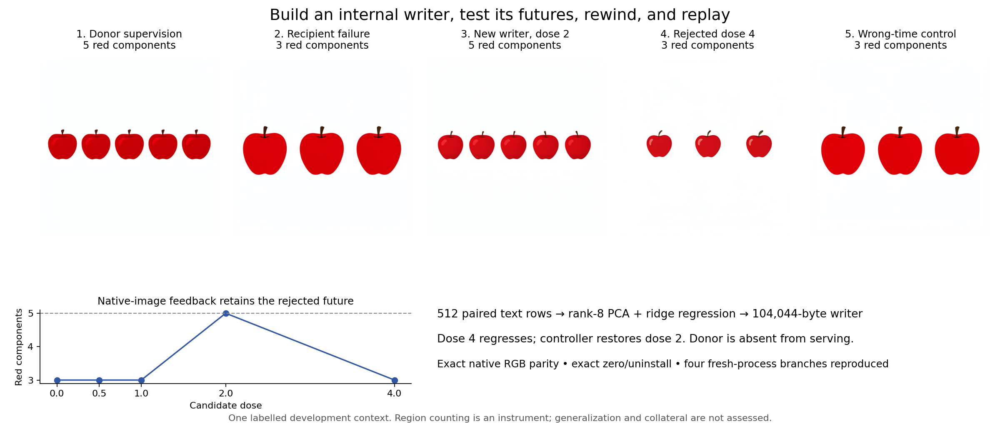

# Build a writer, debug its futures, and replay

One command runs the complete public workflow in three sequential Python processes:
paired-state construction, recipient feedback and rollback, then fresh-process serving.
It imports no scheduler. Checkpoint defaults are pinned public Hugging Face repository IDs.

```bash
pip install -e '.[diffusion,train]'
python experiments/flux2_writer/run.py
```

The public diffusers loaders acquire the checkpoints from Hugging Face or reuse your
Hub cache. Authenticate with the Hub if model access requires it. To use existing
checkpoint directories without network access:

```bash
python experiments/flux2_writer/run.py \
  --base-model /path/to/FLUX.2-klein-base-4B \
  --model /path/to/FLUX.2-klein-4B --local-files-only
```

Use `--dry-run` to inspect the exact commands, `--output` for a fresh result directory,
and `--recipe` for a JSON copy of your own prompt, seed, rank, and count target.
The current feedback instrument counts red connected components; replace the evaluator
when changing to another task. A nonempty output directory is refused to preserve evidence.

## Process and artifacts

1. Render a 50-step native base pipeline and a four-step native distilled recipient.
2. Capture each first conditional prefix at `joint.2` using a new Saturn Session;
   verify exact equality with the corresponding native block output.
3. Fit a rank-eight PCA/ridge residual writer from the paired text states. Save its
   arrays, checksum, construction lineage, cuts, and receipts.
4. Load only the recipient and new writer. Compare same-parent image futures at
   doses 0, 0.5, 1, 2, and 4. Preserve rejected futures and restore the controller closure.
5. Check native RGB parity, zero dose, wrong timing, commit, restore, and uninstall.
6. Load recipient, writer, and saved cut in a fresh interpreter. Verify native, patched,
   zero-dose, and uninstall records, including final latents and pixel checksums.

`outputs/flux2-writer/` contains images, `writer.npz`, `writer.json`, both cut stores,
typed receipts, construction/feedback/replay reports, a source/command manifest,
and the combined `experiment-report.json`. Outputs remain ordinary local files,
so your runner can persist or upload the directory through its own artifact mechanism.

The supplied prompt, seed, address, rank, paired supervision, dose proposals, and count
target are declared in the recipe. The residual mapping is fitted; RGB feedback selects
only the dose. Native diffusers performs the complete donor CFG loop. Saturn verifies
its conditional prefix and executes recipient continuations. See the
[implementation and claim boundaries](../../docs/writer-demo.md).

## Reference observation



The [reference result](reference-result.json) records the measured CUDA/BF16 run:
native three apples, newly built 104 KB writer at dose two gives five, dose four
regresses to three and is rejected, exact rollback and four fresh-process replays.
Generalization and collateral are unassessed. The figure shows actual rendered images.
It is a historical observation, not a requirement that every device reproduce these pixels.

The measured workload used about 18.8 GB host RAM and 8.3 GB GPU memory on a 16 GB
RTX 4080. Provide memory headroom and storage for both full checkpoints. This recipe
currently requires CUDA; the small offline library examples also support CPU.

## Other runners

Run the same command on your own CUDA machine, a rented GPU VM, a notebook terminal,
or a container job. The runtime needs access to weights, PyTorch tensors, and the native
model modules. A hosted inference-only API does not expose the state needed for this
capture/intervention/replay experiment.

Hugging Face Jobs can execute a Docker image with a command and GPU hardware
([official guide](https://huggingface.co/docs/huggingface_hub/guides/jobs)). Put this
checkout and its public dependencies in that image, run the command above, and persist
`outputs/flux2-writer/` using the job's storage or upload mechanism. The image must
contain the whole checkout: this runner invokes sibling examples and package source.
No Hugging Face cloud job was launched or paid for during this validation.
